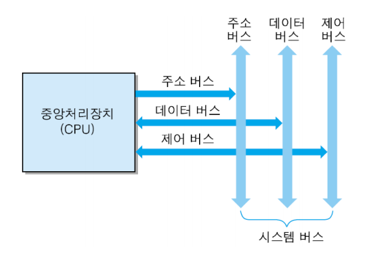

# 목차
- [컴퓨터 시스템의 소개](#chapter-01)
    - [컴퓨터 하드웨어의 구성](#chapter-01-01)

# 컴퓨터시스템 개요 
# 컴퓨터의 기본 구조 
**하드웨어** : 컴퓨터에서 정보의 전송 통로를 제공하고, 정보를 처리하는 물리적 실체들  
**소프트웨어** : 정보의 이동 방향, 정보 처리의 종류, 수행 시간을 지정해주는 명령들의 집합 (시스템 소프트웨어, 응용 소프트웨어)
## 컴퓨터의 기본 구조
### 컴퓨터의 기능
- 중앙처리장치
    - 프로그램 실행과 데이터 처리
    - 프로세서(CPU)
- 기억장치(Memory)
    - 프로그램 코드와 데이터 저장
    - 주기억장치(가격이 높고 면적을 많이 차지하기 때문에 저장 용량에 한계가 있다. 영구 저장 능력이 없기 때문에 프로그램 실행 중에만 일시적으로 사용되는 기억장치), 보조저장장치(저장 밀도가 높고 비트당 가격이 저렴하지만, 기계적인 장치가 포함되거나 쓰기 동작이 복잡한 반도체 칩들을 이용하기 때문에 속도가 느리다.)
- 입출력장치(I/O)
    - 사용자와 컴퓨터 간의 대화를 위한 장치
    - CPU는 해당 장치 제어기를 통하여 동작 제어
    - 주변장치

## 정보의 표현과 저장
- 컴퓨터 정보
    - 프로그램 코드와 데이터
    - 비트들의 조합으로 표현
- 컴퓨터 언어
    - 기계어
    - 어셈블리 언어(언어상의 차이를 해결하기 위하여 고급 언어와 기계어 사이에 고유의 중간 언어)
    - 고급 언어
- 연산코드 필드와 오퍼랜드 필드
    - 연산코드 : CPU가 수행할 연산을 지정
    - 오퍼랜드 : 연산에 사용될 데이터 혹은 기억장치 주소

## 시스템의 구성
### CPU와 기억장치의 접속
- 시스템 버스 : CPU와 다른 요소들 간의 정보 교환 통로
    - 주소 버스 : CPU가 외부로 발생하는 주소 정보를 전송하는 신호 선들의 집합이다. 
    - 데이터 버스 : CPU가 기억장치 혹은 I/O 장치와의 사이에 데이터를 전송하기 위한 신호 선들의 집합이다.
    - 제어 버스 : CPU가 시스템 내의 각종 요소들의 동작을 제어하는 데 필요한 신호 선들의 집합이다.   
  
