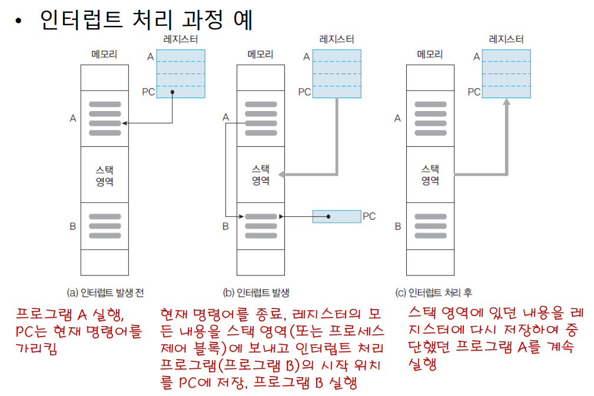
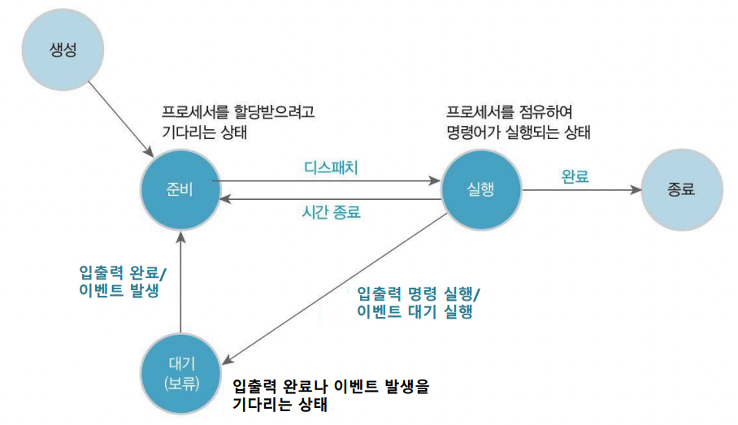
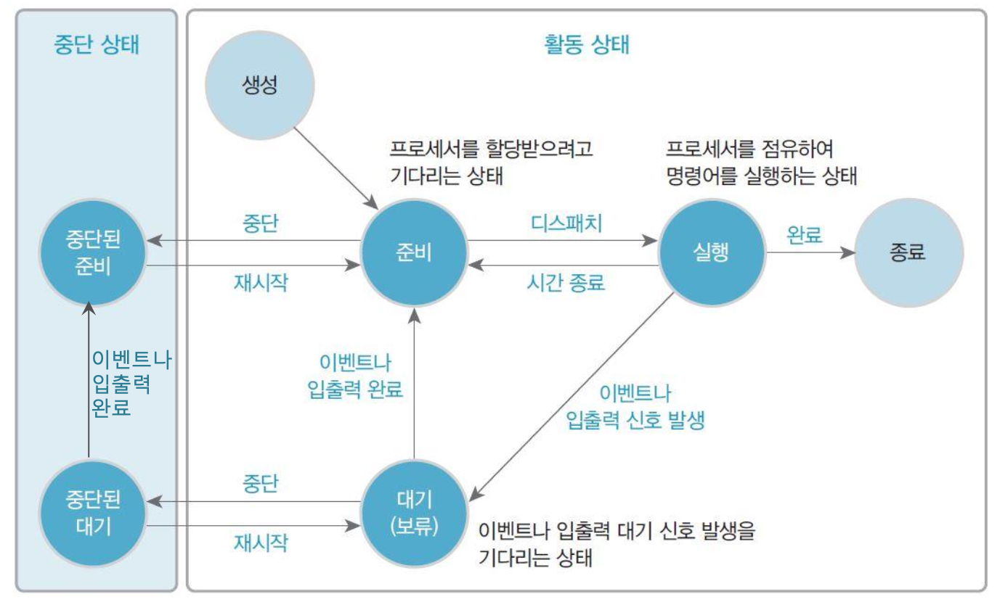

# 목차
- [컴퓨터 시스템의 소개](#chapter-01)
    - [컴퓨터 하드웨어의 구성](#chapter-01-01)
    - [컴퓨터 시스템의 동작](#chapter-01-02)
- [프로세스와 스레드](#chapter-03)
    - [프로세스의 개념과 상태 변화](#chapter-03-01)
    - [프로세스의 관리](#chapter-03-02)
    - [스레드의 개념과 상태 변화](#chapter-03-03)
    - [스레드의 구현](#chapter-03-04)
# 컴퓨터 시스템의 소개 <a id="chapter-01"></a>
# 컴퓨터 하드웨어의 구성 <a id="chapter-01-01"></a>
- 운영체제(Operating System)
    - 컴퓨터 시스템의 효율성을 향상시키고 사용자에게 편리한 환경을 제공하기 위한 소프트웨어
    - 컴퓨터 하드웨어와 사용자 사이에 위치하며 하드웨어와 소프트웨어 자원을 관리

   

## 프로세서(processor)
- 컴퓨터의 모든 장치의 동작을 제어하고 명령을 실행하는 하드웨어
- CPU(중앙처리장치)라고 부름.


### 레지스터(register)s
- 프로세서 내부에 위치한 고속의 메모리
- 프로세서가 바로 사용할 수 있는 데이터를 저장
    - 특수한 목적의 값을 저장하는 기억 공간으로 사용하기도 함.
    - 연산을 수행하다가 중간 값을 저장하기도 함.

- 컴퓨터의 구조에 따라 크기와 종류가 다양
- `사용자 가시 레지스터(User-Visible Register)`
    - 사용자가 운영체제와 사용자 프로그램을 이용해 정보 변경 가능
        - 데이터 레지스터
        - 주소 레지스터
- `사용자 불가시 레지스터(User-Invisible Register)`
    - 사용자가 레지스터에 저장된 정보를 변경할 수 없음
    - 프로세서 제어와 상태 관리에 사용됨
        - 프로그램 카운터 : 다음에 실행할 명령어의 주소를 보관하는 레지스터
        - 명령어 레지스터 : 현재 실행하는 명령어를 보관하는 레지스터
        - 누산기 : 데이터를 일시적으로 저장하는 레지스터
        - 메모리 주소 레지스터 : 프로세서가 참조하려는 데이터의 주소를 명시하여 메모리에 접근하는 버퍼 레지스터
        - 메모리 버퍼 레지스터 : 메모리에서 읽거나 메모리에 저장할 데이터 자체를 보관하는 버퍼 레지스터

## 메모리(memory)
### 데이터 계층 구조
- 메모리를 계층적으로 구성하여 가격, 속도, 용량이 다른 메모리를 상호 보완하도록 효과적으로 사용함으로써 시스템의 성능을 향상시킴

> 출처 : 그림으로 배우는 구조와 원리 운영체제
### 레지스터(register)
- 프로세서 내부에 존재
- 프로세서 사용할 데이터를 보관하는 가장 빠른 메모리

### 메인 메모리(main memory)
- 프로세서 외부에 존재
- 프로세서에서 수행할 프로그램과 데이터를 저장
- 프로세서에서 처리한 결과를 저장
- 주기억장치 또는 1차 기억장치라고도 함.
- 저장 밀도가 높고 가격이 싼 DRAM(Dynamic RAM)을 사용

> 출처 : 그림으로 배우는 구조와 원리 운영체제
- 다수의 셀(cell)들로 구성되며, 각 셀은 여러 비트로 구성
- 하나의 셀이 K비트이면 2^k값 저장 가능
- 메인 메모리에 데이터를 저장할 때는 셀 한 개나 여러 개에 나누어서 저장
- 셀은 주소로 참조하는데, 주소가 n비트이면 주소 범위는 0 ~ 2^n - 1

#### 메모리 매핑(mapping, 사상)
- 논리적 주소를 물리적 주소로 변환하는 과정

#### 메모리 속도
- 메모리 접근시간과 메모리 사이클 시간으로 표현


> 출처 : 그림으로 배우는 구조와 원리 운영체제
- 프로세서와 보조기억장치 사이에 있으며, 여기에 발생하는 디스크 입출력 병목 현상을 해결하는 역할도 수행
- **프로세서와 메인 메모리 간에 속도 차이의 부담을 줄이려고** 프로세서 내부나 외부에 캐시를 구현하기도 함

### 캐시(cashe)

- 프로세서 내부나 외부에 있으며, 처리 속도가 빠른 프로세서와 상대적으로 느린 메인 메모리의 속도 차이를 보완하는 고속 버퍼
- 자주 참조되는 프로그램과 데이터를 메인 메모리보다 속도가 빠른 캐시에 저장하여 평균 접근 시간을 줄이고 시스템 성능을 향상
- 캐시의 성능은 작은 용량의 캐시에 프로세서가 이후 참조할 정보가 얼마나 들어있나에 좌우됨
    - `캐시 적중(cashe hit)` : 프로세서가 참조하려는 정보가 있을 때
    - `캐시 실패(cashe miss)` : 프로세서가 참조하려는 정보가 없을 때
- **지역성과 캐시 적중률(cashe hit ratio)**
    - `공간적 지역성(spatial locality)` : 참조한 주소와 인접한 주소를 참조하는 특성
    - `시간적 지역성(temporal locality)` : 한 번 참조한 주소를 곧 다시 참조하는 특성
        - ex) 반복문

### 보조기억장치(auxiliary storage)
- 주변장치 중에서 프로그램과 데이터를 저장하는 하드웨어
- 2차 기억장치 또는 외부기억장치라고도 함
- 용량은 크고, 속도는 느림
- 자기디스크, 광디스크, 자기테이프 등이 있음

## 시스템 버스(system bus)

- 하드웨어를 물리적으로 연결하여 서로 데이터를 주고받을 수 있게 하는 통로
- 컴퓨터 내부의 다양한 신호(데이터 입출력 신호, 프로세서 상태 신호, 인터럽트 요구와 허가 신호, 클록 신호 등)를 시스템 버스로 전달
- 기능에 따라 데이터 버스, 주소 버스, 제어 버스로 구분
    - 데이터 버스 : 프로세서와 메인 메모리, 주변장치 사이에서 **데이터를 전송**한다. 데이터 버스를 구성하는 배선 수는 프로세서가 한 번에 전송할 수 있는 비트 수를 결정하는데, 이를 `워드`라고 한다.
    - 주소 버스 : 프로세서가 시스템의 구성 요소를 식별하는 **주소 정보**를 전송한다. 주소 버스를 구성하는 배선 수는 프로세서와 접속할 수 있는 메인 메모리의 최대 용량을 결정한다.
    - 제어 버스 : 프로세서가 시스템의 구성 요소를 제어하는 데 사용한다. 제어 신호로 연산장치의 연산 종류와 메인 메모리의 읽기나 쓰기 동작을 결정한다.

## 주변장치
- 입력장치 : 컴퓨터에서 처리할 데이터를 외부에서 입력하는 장치(ex. 키보드, 마우스)
- 출력장치 : 컴퓨터에서 처리한 데이터를 외부로 보내는 장치(ex. 모니터, 프린터, 스피커)
- 저장장치 : 메인 메모리와 달리 거의 영구적으로 데이터를 저장하는 장치(ex. 하드디스크, USB 메모리)

# 컴퓨터 시스템의 동작 <a id="chapter-01-02"></a>
- 컴퓨터 시스템의 작업 처리 순서
    1. 입력 장치를 통해 정보를 입력 받아 메모리 저장
    2. 메모리에 저장된 정보를 프로그램의 제어에 따라 인출하여 연산 장치에서 처리
    3. 처리한 정보를 출력 장치에 표시하거나 보조기억장치에 저장

## 명령어의 구조 
- 연산 부호 : 프로세서가 실행할 동작인 연산을 지정한다. 연산 부호가 n비트이면 2^n개 연산이 가능하다.
- 피연산자 : 연산할 데이터 정보를 저장한다.

명령어는 실행 전에 **메인 메모리**에 저장하며, 한 번에 하나씩 프로세서에 순차적으로 전송하여 해석, 실행. 

- 직접 주소 : 데이터가 있는 레지스터나 메모리 주소를 지정
- 간접 주소 : 데이터가 있는 레지스터나 메모리 주소 정보를 지정

## 명령어의 실행
````
명령어 인출 -> 명령어 해석, 프로그램 카운터 변경 -> 피연산자 인출 -> 명령어 실행 -> 결과 저장
````
제어장치가 명령어를 실행하고, 메모리에서 명령어를 한 번에 하나씩 인출하고 해석하여 연산한다. 명령어를 인출하여 연산 완료한 시점까지 인출-해석-실행 사이클 또는 인출-실행 사이클이라고 한다.

### 인출 사이클
- 인출 사이클은 명령어 실행 사이클의 첫 번째 단계이다. 

### 실행 사이클
- 인출한 명령어를 해독하고 그 결과에 따라 제어 신호를 발생 시켜 명령어를 실행한다. 

1. PC -> MAR : PC에 저장된 프로세서를 내부 버스를 이용하여 MAR에 전달
2. MAR -> MBR : MAR에 저장된 주소에 해당하는 메모리 위치에서 명령어를 인출한 후 이 명령어를 MBR에 저장한다. 제어장치는 메모리에 저장된 내용을 읽도록 제어 신호 발생
3. PC + 1 -> PC : 다음 명령어를 인출하기 위해 PC를 증가시킨다.
4. MBR -> IR : MBR에 저장된 내용을 IR에 전달한다.

> PC : 프로그램 카운터
> IR : 명령어 레지스터
> MAR : 메모리 주소 레지스터
> MBR : 메모리 버퍼 레지스터

## 인터럽트 명령어
- 프로세서가 프로그램을 실행하는 동안 컴퓨터 시스템 내부나 외부에서 발생하는 예기치 못한 사건

### 인터럽트 발생
- 현재 실행 중인 프로그램을 중단하고 다른 프로그램의 실행을 요구하는 명령
- 입출력장치나 프로그램 등에서 프로세서로 보내는 하드웨어 신호

### 인터럽트의 처리
- 프로그램의 정상 실행을 일시 중단했다가 재개하는 과정이 필요하지만, 사용자가 별도로 **인터럽트 처리 조치를 할 필요가 없고 프로세서와 운영체제가 처리**
- 처리 과정
    1. 인터럽트 요청 신호 발생
    2. 운영체제가 제어를 넘겨받음
    3. 실행 중인 프로그램 상태를 메모리 저장
    4. 인터럽트 처리 프로그램으로 분기
    5. 인터럽트 처리 프로그램을 완료 후 인터럽트를 받았던 프로그램으로 제어를 돌려줌

### 인터럽트 요청 회선
- 인터럽트 목적으로 사용하는 제어 버스
- 인터럽트를 이용하면 프로세서가 외부장치의 상태를 직접 점검할 필요 X

- 단일회선 : 모든 장치를 공통의 단일 회선으로 프로세서에 연결
- 다중 회선 : 모든 장치를 서로 다른 고유의 회선으로 프로세서에 연결


# 프로세스와 스레드 <a id="chapter-03"></a>
# 프로세스의 개념과 상태 변화 <a id="chapter-03-01"></a>
## 프로세스의 개념
- 다중 프로그래밍에서 여러 프로그램이 자원을 공유하므로 프로그램들을 제어하는 방법이 필요
- 디스크에 저장되어 있던 프로그램이 메모리에 적재되어 운영체제의 제어를 받는 상태
- ex) 웹 브라우저 창을 열면 프로세스 한 개, 2개를 열면 2개를 생성하는 것
- 프로세스를 생성하거나 실행될 때 프로세서 점유 시간, 메모리, 파일, 입출력장치 같은 자원을 할당.
### 프로세스의 주소 공간
#### 실행 스택(stack)
- 호출된 프로시저(함수)의 복귀 주소와 지역 변수 등의 일시적인 데이터를 저장하는 영역
#### 실행 힙(heap)
- 시스템 호출을 통해 동적으로 할당받고 해지하는 등 자유롭게 이용하는 영역
#### 데이터
- 전역 또는 정적 변수 저장
#### 텍스트
- 프로그램 코드

### 프로세스의 종류
> 수행하는 역할에 따라 **시스템 프로세스**와 **사용자 프로세스**로 구분하고, 병행 수행 방법에 따라 **독립 프로세스**와 **협력 프로세스**로 구분한다.

#### 시스템 프로세스
- 커널 프로세스 또는 운영체제 프로세스라고 부름.
- 모든 시스템 메모리에 접근하고, 모든 프로세서 명령을 실행할 수 있는 프로세스
- 커널 모드에서 실행하고, 특권 명령어를 포함하여 모든 명령어를 실행 가능

#### 사용자 프로세스
- 사용자 코드를 수행하는 프로세스
- 사용자 모드에서 실행하고, 시스템에 중요한 영향을 미치는 명령어는 실행할 수 없음.

#### 독립 프로세스
- 병행 프로세스들이 서로 영향을 주고 받지 않음
- 데이터 공유 안함

#### 협력 프로세스
- 병행 프로세스들이 서로 영향을 주고 받음.
- 서로 협력해야 하는 경우, 통신을 위한 수단과 동기화 기능 필요

## 프로세스의 상태 변화와 상태 정보


### 프로세스 상태
> 대부분의 프로세스는 준비나 대기(보류) 상태이며, 어느 한 순간에 한 프로세스만 실행 상태

상태 변화 | 표기 방법
------------ | -------------
준비 -> 실행 | dispatch(프로세스 이름)
실행 -> 준비 | timeout(프로세스 이름)
실행 -> 대기(보류) | block(프로세스 이름)
대기(보류) -> 준비 | wakeup(프로세스 이름)

> 4가지 상태 변화 중, block은 프로세스 스스로 하고, 나머지는 외부 조건에 의해 이루어짐
#### dispatch (준비 -> 실행)
- 준비 상태의 프로세스가 프로세서를 할당 받으면 실행 상태가 됨

#### timeout (실행 -> 준비)
- 실행 상태의 프로세스가 프로세서를 자발적으로 반납하기 전에 할당된 시간이 지나면 그 프로세스는 준비 상태가 됨
- `인터럽트 클록(Interrupt clock)`을 두어 특정 프로세스가 프로세서를 독점하는 것을 방지

#### block (실행 -> 대기(보류))
- 실행 상태의 프로세스가 자신에게 할당된 시간이 끝나기 전에 전에 입출력 요청, 새로운 자원 요청 등, 어떤 이벤트가 발생하는 것을 기다려야 할 때 스스로 프로세서를 양도하고 대기 상태가 됨.

#### wakeup(대기(보류) -> 준비)
- 기다리던 조건이 만족되면 대기 상태인 프로세스는 준비 상태가 됨.

### 프로세스 제어 블록
- 운영체제가 각 프로세스를 관리하기 위해 필요한 정보를 저장해두는 자료 구조

### 프로세스의 문맥 교환(context switching)
- 인터럽트나 시스템 호출 등으로 실행 중인 프로세스의 제어를 다른 프로세스에 넘겨 실행 상태가 되도록 하는 것
- 프로세서의 레지스터에 있던 내용 등을 나중에 재개되었을 때 사용할 수 있도록 PCB에 저장

# 프로세스의 관리 <a id="chapter-03-02"></a>
## 프로세스의 구조
- 프로세스 실행 중 프로세스 생성 시스템 호출을 이용하여 새로운 프로세스 생성(부모 프로세스가 자식 프로세스를 생성하는 과정을 반복)
- 프로세스 생성, 종료, 제거, 중단과 재시작, 우선순위 변경, 문맥 교환

## 프로세스의 생성
- 운영체제 또는 다른 프로세스의 요청에 의해 프로세스 생성
### 프로세스 생성 과정
1. 새로운 프로세스에 프로세스 식별자 할당
2. 프로세스의 주소 공간과 프로세스 제어 블록 할당
3. 프로세스 제어 블록 초기화
4. 큐에 삽입

### 자원 할당
- 자식 프로세스에게 필요한 자원을 운영체제로부터 직접 할당을 받거나, 부모 프로세스의 자원 일부를 사용

### 실행 방식
- 부모 프로세스와 자식 프로세스가 동시에 실행
- 부모 프로세스는 자식 프로세스들이 모두 종료할 때까지 기다림

### 주소 공간
- 자식 프로세스가 부모 프로세스의 주소 공간을 복사
- 자식 프로세스가 별도의 프로그램을 적재

## 프로세스 종료
- 프로세서가 마지막 명령을 실행하면 종료하여 운영체제에 프로세서 제거를 요청

### 부모 프로세서가 자식 프로세스 종료 기능
- 부모 프로세스종료하면 운영체제가 자식 프로세스도 종료(연속 종료)
- 부모 프로세스가 abort 시스템 호출하여 자식 프로세스 종료

### 프로세스 종료 이유
- 정상 종류, 명시된 전체 시간 초과, 오류 발생, 메모리 부족 등

## 프로세스의 제거
- 프로세스 종류 후 프로세스를 파괴하는 것
    - 프로세스가 점유하고 있던 자원을 시스템에 반납
    - 해당 프로세스가 시스템 리스트나 테이블에서 사라짐
- 프로그램은 여전히 디스크에 저장
- 부모 프로세스를 제거하면 자식 프로세스도 자동 제거

## 프로세스의 중단과 재시작

### 두 가지 중단 상태
- 중단된 대기
    - 프로세스가 보조 기억장소에 있고, 이벤트를 대기 중인 상태
- 중단된 준비
    - 프로세스가 보조 기억장소에 있으나, 바로 메인 메모리로 로드하여 실행할 수 있는 상태

## 프로세스의 우선순위 변경
- 프로세스 스케줄러는 프로세스 제어 블록에 기록된 우선 순위를 이용하여 준비 리스트의 프로세스들을 처리
### 우선 순위 구분
#### 프로세서 중심 프로세스(CPU-bound process)
- 낮은 우선 순위
- 프로세서를 한 번 차지하면 오래 사용
- 시간 할당량을 길게 함으로써 프로세서 사용 휫수는 적지만 한 번에 오래 사용

#### 입출력 중심 프로세스(I/O-bound process)
- 높은 우선 순위
- 프로세서를 한 번 차지하면 짧게 사용하는 경향

## 프로세스의 문맥 교환
### 인터럽트
- 현재 실행 중인 프로세스와 별도로 외부에서 발생되는 여러 종류의 이벤트에 의해 발생
- 실행 중인 프로세스로부터 인터럽트 처리 루틴으로 제어가 넘어감
    - 입출력 인터럽트 : 입출력 완료를 확인하고 이 이벤트를 기다리던 프로세스를 준비 상태로 바꾼 후 실행할 프로세스를 결정
    - 클록 인터럽트 : 실행 중인 프로세스를 준비 상태로 바꾸고, 다른 프로세스를 실행 상태로 전환

### 트랩(trap)
- 부적절한 파일 접근 또는 현재 실행 중인 프로세스의 오류나 예외 상황으로 인해 발생
- 치명적인 오류이면 프로세스를 종료하고 프로세스 문맥 교환

# 스레드의 개념과 상태 변화 <a id="chapter-03-03"></a>
## 스레드의 개념
- 프로세서를 사용하는 기본 단위이며, 명령어를 독립적으로 실행할 수 있는 하나의 흐름

### 프로세스와 스레드
- 각 프로세스는 **스레드를 하나 이상** 가짐
- 같은 프로세스 내의 스레드들과 `코드, 주소 공간, 운영체제의 자원(파일, 신호) 등` 을 공유
- 각자 `레지스터, 스레드 우선순위, 스레드 상태` 를 지님

> 하나의 프로세스에 속한 스레드들은 동일한 주소 공간 공유

### 스레드의 사용
- 사용자 응답성 증가 : 사용자와의 상호 작용 가능
- 프로세스의 자원과 메모리 공유 가능 : 응용 프로그램 하나가 동일한 주소 공간에서 스레드를 여러 개 실행하여 시스템 성능 향상(스레드들이 프로세스 자원 하나와 메모리를 공유하기 때문)

# 스레드의 구현 <a id="chapter-03-04"></a>
- 사용자 수준 스레드(user-level thread)
    - **다대일 스레드 매핑**
    - 스레드 라이브러리를 이용하여 작동
- 커널 수준 스레드(kernel-level thread)
    - **일대일 스레드 매핑**
    - 커널에서 스레드를 지원
- 혼합형 스레드
    - 사용자 수준 스레드와 커널 수준 스레드 혼합
    - **다대다 스레드 매핑**

## 사용자 수준 스레드
- 커널 스레드를 지원하지 않는 운영체제에서 사용
    - 커널은 스레드가 아닌 프로세스를 하나의 단위로 인식하여 스케줄링하고, 하나의 상태를 할당
    - 여러 사용자 수준 스레드들이 하나의 커널 스레드(프로세스)로 매핑되므로 다대일 스레드 매핑

### 장점
- 이식성이 높음 : 기본 커널 변경 없이 모든 운영체제에 적용
- 커널 전환 오버헤드가 적음 : 스케줄링, 동기화에 커널을 호출하지 않아 커널 영역으로 전환 오버헤드 감소
- 스케줄링 유연성 : 스레드 라이브러리에서 스케줄링을 제어하므로 응용 프로그램에 맞게 스케줄링 가능
> 오버헤드 : 어떤 처리를 하기 위해 들어가는 간접적인 처리 시간 · 메모리 등

### 단점
- 동시성 지원x
- 다중 프로세서 시스템 규모 확장 제약
- 스레드 간 보호에 커널 보호 기법 사용 불가능

## 커널 수준 스레드 
- 일대일 스레드 매핑
- 스레드 관련 모든 작업을 **커널이 지원**

### 장점
- 시스템의 동시성 지원
- 병렬 실행으로 성능 향상 가능

### 단점
- 스케줄링과 동기화를 위한 커널 호출 오버헤드
- 이식성이 떨어짐
- 사용자 스레드 수 증가시 막대한 수의 커널 스레드를 관리해야 하는 오버헤드

## 혼합형 스레드의 개념
- 사용자 수준 스레드와 커널 수준 스레드 혼합
- **스레드 풀링(thread pooling)** 기법
    - 시스템이 관리하는 스레드의 풀을 응용 프로그램에 제공하여 스레드를 효율적으로 사용할 수 있게 하는 방법
    - 미리 생성한 스레드의 재사용으로 스레드 생성하는 시간 줄임
    - 동시 생성 가능한 스레드 수 제한