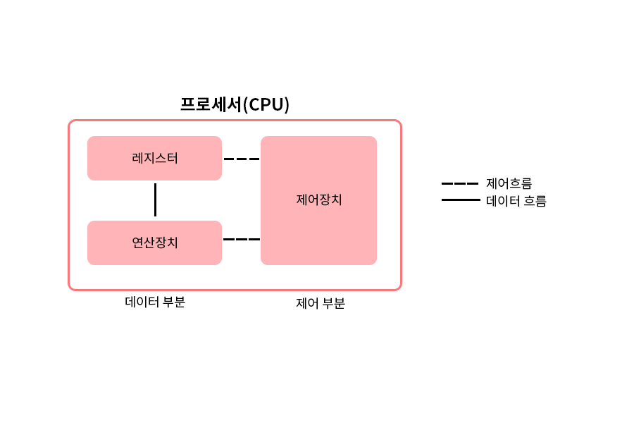
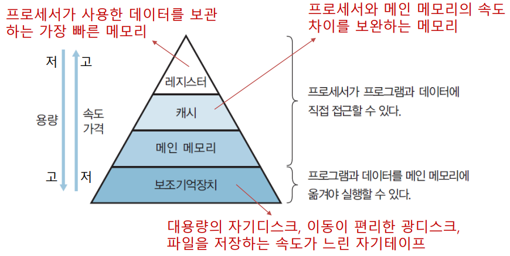
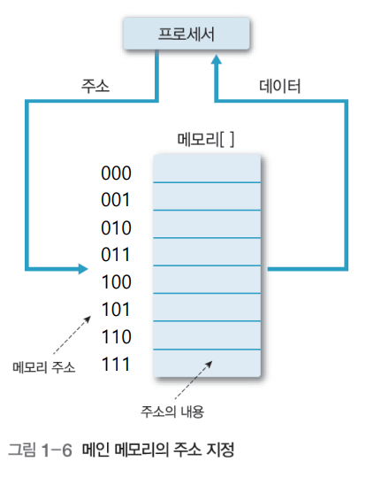
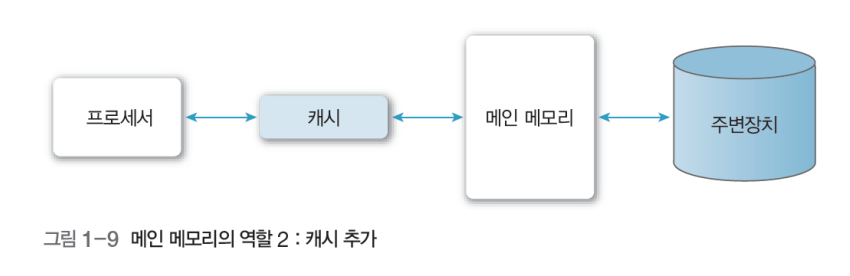
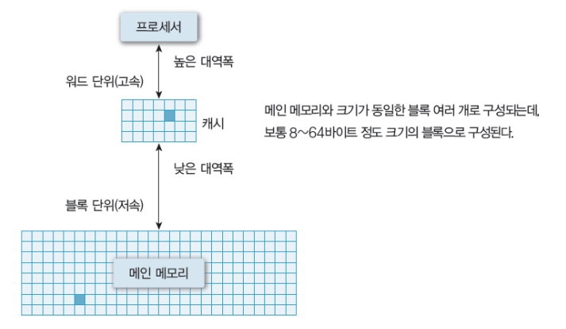
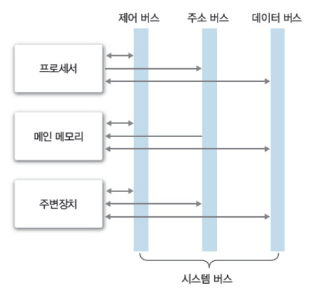

# 목차
- [컴퓨터 시스템의 소개](#chapter-01)
    - [컴퓨터 하드웨어의 구성](#chapter-01-01)
    - [컴퓨터 시스템의 동작](#chapter-01-02)
# 컴퓨터 시스템의 소개 <a id="chapter-01"></a>
# 컴퓨터 하드웨어의 구성 <a id="chapter-01-01"></a>
- 운영체제(Operating System)
    - 컴퓨터 시스템의 효율성을 향상시키고 사용자에게 편리한 환경을 제공하기 위한 소프트웨어
    - 컴퓨터 하드웨어와 사용자 사이에 위치하며 하드웨어와 소프트웨어 자원을 관리

   

## 프로세서(processor)
- 컴퓨터의 모든 장치의 동작을 제어하고 명령을 실행하는 하드웨어
- CPU(중앙처리장치)라고 부름.


### 레지스터(register)
- 프로세서 내부에 위치한 고속의 메모리
- 프로세서가 바로 사용할 수 있는 데이터를 저장
    - 특수한 목적의 값을 저장하는 기억 공간으로 사용하기도 함.
    - 연산을 수행하다가 중간 값을 저장하기도 함.

- 컴퓨터의 구조에 따라 크기와 종류가 다양
- `사용자 가시 레지스터(User-Visible Register)`
    - 사용자가 운영체제와 사용자 프로그램을 이용해 정보 변경 가능
        - 데이터 레지스터
        - 주소 레지스터
- `사용자 불가시 레지스터(User-Invisible Register)`
    - 사용자가 레지스터에 저장된 정보를 변경할 수 없음
    - 프로세서 제어와 상태 관리에 사용됨
        - 프로그램 카운터 : 다음에 실행할 명령어의 주소를 보관하는 레지스터
        - 명령어 레지스터 : 현재 실행하는 명령어를 보관하는 레지스터
        - 누산기 : 데이터를 일시적으로 저장하는 레지스터
        - 메모리 주소 레지스터 : 프로세서가 참조하려는 데이터의 주소를 명시하여 메모리에 접근하는 버퍼 레지스터
        - 메모리 버퍼 레지스터 : 메모리에서 읽거나 메모리에 저장할 데이터 자체를 보관하는 버퍼 레지스터

## 메모리(memory)
### 데이터 계층 구조
- 메모리를 계층적으로 구성하여 가격, 속도, 용량이 다른 메모리를 상호 보완하도록 효과적으로 사용함으로써 시스템의 성능을 향상시킴

> 출처 : 그림으로 배우는 구조와 원리 운영체제
### 레지스터(register)
- 프로세서 내부에 존재
- 프로세서 사용할 데이터를 보관하는 가장 빠른 메모리

### 메인 메모리(main memory)
- 프로세서 외부에 존재
- 프로세서에서 수행할 프로그램과 데이터를 저장
- 프로세서에서 처리한 결과를 저장
- 주기억장치 또는 1차 기억장치라고도 함.
- 저장 밀도가 높고 가격이 싼 DRAM(Dynamic RAM)을 사용

> 출처 : 그림으로 배우는 구조와 원리 운영체제
- 다수의 셀(cell)들로 구성되며, 각 셀은 여러 비트로 구성
- 하나의 셀이 K비트이면 2^k값 저장 가능
- 메인 메모리에 데이터를 저장할 때는 셀 한 개나 여러 개에 나누어서 저장
- 셀은 주소로 참조하는데, 주소가 n비트이면 주소 범위는 0 ~ 2^n - 1

#### 메모리 매핑(mapping, 사상)
- 논리적 주소를 물리적 주소로 변환하는 과정

#### 메모리 속도
- 메모리 접근시간과 메모리 사이클 시간으로 표현


> 출처 : 그림으로 배우는 구조와 원리 운영체제
- 프로세서와 보조기억장치 사이에 있으며, 여기에 발생하는 디스크 입출력 병목 현상을 해결하는 역할도 수행
- **프로세서와 메인 메모리 간에 속도 차이의 부담을 줄이려고** 프로세서 내부나 외부에 캐시를 구현하기도 함

### 캐시(cashe)

- 프로세서 내부나 외부에 있으며, 처리 속도가 빠른 프로세서와 상대적으로 느린 메인 메모리의 속도 차이를 보완하는 고속 버퍼
- 자주 참조되는 프로그램과 데이터를 메인 메모리보다 속도가 빠른 캐시에 저장하여 평균 접근 시간을 줄이고 시스템 성능을 향상
- 캐시의 성능은 작은 용량의 캐시에 프로세서가 이후 참조할 정보가 얼마나 들어있나에 좌우됨
    - `캐시 적중(cashe hit)` : 프로세서가 참조하려는 정보가 있을 때
    - `캐시 실패(cashe miss)` : 프로세서가 참조하려는 정보가 없을 때
- **지역성과 캐시 적중률(cashe hit ratio)**
    - `공간적 지역성(spatial locality)` : 참조한 주소와 인접한 주소를 참조하는 특성
    - `시간적 지역성(temporal locality)` : 한 번 참조한 주소를 곧 다시 참조하는 특성
        - ex) 반복문

### 보조기억장치(auxiliary storage)
- 주변장치 중에서 프로그램과 데이터를 저장하는 하드웨어
- 2차 기억장치 또는 외부기억장치라고도 함
- 용량은 크고, 속도는 느림
- 자기디스크, 광디스크, 자기테이프 등이 있음

## 시스템 버스(system bus)

- 하드웨어를 물리적으로 연결하여 서로 데이터를 주고받을 수 있게 하는 통로
- 컴퓨터 내부의 다양한 신호(데이터 입출력 신호, 프로세서 상태 신호, 인터럽트 요구와 허가 신호, 클록 신호 등)를 시스템 버스로 전달
- 기능에 따라 데이터 버스, 주소 버스, 제어 버스로 구분
    - 데이터 버스 : 프로세서와 메인 메모리, 주변장치 사이에서 **데이터를 전송**한다. 데이터 버스를 구성하는 배선 수는 프로세서가 한 번에 전송할 수 있는 비트 수를 결정하는데, 이를 `워드`라고 한다.
    - 주소 버스 : 프로세서가 시스템의 구성 요소를 식별하는 **주소 정보**를 전송한다. 주소 버스를 구성하는 배선 수는 프로세서와 접속할 수 있는 메인 메모리의 최대 용량을 결정한다.
    - 제어 버스 : 프로세서가 시스템의 구성 요소를 제어하는 데 사용한다. 제어 신호로 연산장치의 연산 종류와 메인 메모리의 읽기나 쓰기 동작을 결정한다.

## 주변장치
- 입력장치 : 컴퓨터에서 처리할 데이터를 외부에서 입력하는 장치(ex. 키보드, 마우스)
- 출력장치 : 컴퓨터에서 처리한 데이터를 외부로 보내는 장치(ex. 모니터, 프린터, 스피커)
- 저장장치 : 메인 메모리와 달리 거의 영구적으로 데이터를 저장하는 장치(ex. 하드디스크, USB 메모리)

# 컴퓨터 시스템의 동작 <a id="chapter-01-02"></a>
- 컴퓨터 시스템의 작업 처리 순서
    1. 입력 장치를 통해 정보를 입력 받아 메모리 저장
    2. 메모리에 저장된 정보를 프로그램의 제어에 따라 인출하여 연산 장치에서 처리
    3. 처리한 정보를 출력 장치에 표시하거나 보조기억장치에 저장

## 명령어의 구조 
- 연산 부호 : 프로세서가 실행할 동작인 연산을 지정한다. 연산 부호가 n비트이면 2^n개 연산이 가능하다.
- 피연산자 : 연산할 데이터 정보를 저장한다.

명령어는 실행 전에 **메인 메모리**에 저장하며, 한 번에 하나씩 프로세서에 순차적으로 전송하여 해석, 실행. 

- 직접 주소 : 데이터가 있는 레지스터나 메모리 주소를 지정
- 간접 주소 : 데이터가 있는 레지스터나 메모리 주소 정보를 지정

## 명령어의 실행
````
명령어 인출 -> 명령어 해석, 프로그램 카운터 변경 -> 피연산자 인출 -> 명령어 실행 -> 결과 저장
````
제어장치가 명령어를 실행하고, 메모리에서 명령어를 한 번에 하나씩 인출하고 해석하여 연산한다. 명령어를 인출하여 연산 완료한 시점까지 인출-해석-실행 사이클 또는 인출-실행 사이클이라고 한다.

### 인출 사이클
- 인출 사이클은 명령어 실행 사이클의 첫 번째 단계이다. 

### 실행 사이클
- 인출한 명령어를 해독하고 그 결과에 따라 제어 신호를 발생 시켜 명령어를 실행한다. 
